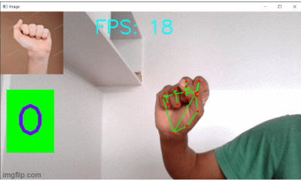

# Number_detection_with_Fingers

In this project, Fingers are counted and displayed on the screen. A Webcam is used to detect the fingers shown by the input user and also displays the corresponding image saved in the folder on the screen. Number of frames that were recorded per second was also shown on the screen. The following libraries are used in the program:

  -cv2: It is used to read, display, write and save Images 
```
import cv2
```
  -os - It is used to display the directory path of the current working folder 
```
import os
```

  -time: Calculates the time required to detect the motion in seconds
```
import time
```
```
import HandTrackingModule as htm
```
  -mediapipe: used to detect the pose of the body like hand, face postures, object detection etc.
```
import mediapipe as mp
```

### Result


